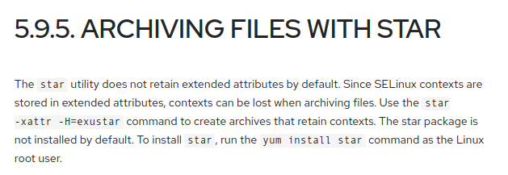

1.f Archive, compress, unpack, and uncompress files using tar, star, gzip, and bzip2
===

Definition
---

+ Compression - encoding information in fewer bits
+ Archive - a file that is a collection of other files that can be managed easier (sorted, moving, copying, etc...)

Archive
---

## tar

'tar' stands for "TApe ARchive".

### Usages

Create a tar archive

    tax -cvf [archive].tar [file(s)|folder]

Extract a tar archive

    tar -xvf [archive].tar

Show all files of an archive:

    tar -tvf [archive].tar

#### Tar with compression

**With gunzip**

Create a compressed tar archive

    tar -czvf [archive].tar.gz [file(s)|folder]

Extract a compressed tar archive

    tar -xzvf [archive].tar.gz

**With bzip2**

Create compressed tar archive

    tar -cjvf [archive].tar.bz2 [file(s)|folder]

Extract a compressed tar archive

    tar -xjvf [archive].tar.bz2

### star - unique standard tape archiver

star is another implementation of tar. It looks like it supported SELinux context before tar (however tar now also supports extended file attributes as well as SELinux, so I'm not sure if this is really needed for the exam).

#### Usage Examples

Create an archive

    # star -c –f=compressed.star [file list]

Extract archive

    # star –x –f=compressed.star

Create an archive retaining SELinux context

    # star -xattr -H=exustar -c -f=test.star file{1,2,3}

*Snippet from RHEL 6 documentation page*

Compression
---

The main difference between the different compress commands is the algorithm that they use.

**Compression commands:**
+ gzip (1)             - compress or expand files
+ bzip2 (1)            - a block-sorting file compressor, v1.0.6
+ zip (1)              - package and compress (archive) files
+ unzip (1)            - list, test and extract compressed files in a ZIP archive

### gunzip

Create a compressed file

    gzip file

_Result: `file.gz`_

Decompress a file:

    gzip -d file

### bzip2

Create a compressed file

    bzip2 file

_Result: `file.bz2`_

Decompress a file

    bzip2 -d file.bz2

### zip/unzip

Combining individual files in a compressed archive:

    zip archive.zip file1 file2

Combining complete folders in a compressed archive:

    zip -r archive.zip folder1 folder2 folder3

Decompress and extract an archive:

    unzip archive.zip

Show all files of an archive:

    unzip -l archive.zip

Notes:
+ Use `-d` on both `gzip` and `bzip2` to extract. For `unzip`, the command itself specifies that it's extracting (`-d` is used for destination folder)
+ For gzip you can specify the compression level with a number (eg: `-5`)
+ Extension name is not required. It's only used for human reference

### Viewing compressed files

You can use the following commands to view compressed files:
+ `zcat`
+ `gunzip -c`
+ `bzip2 -c`
+ `zless`
+ `vim`

---
[⬅️ Back](1-Understand-and-use-essential-tools.md)
