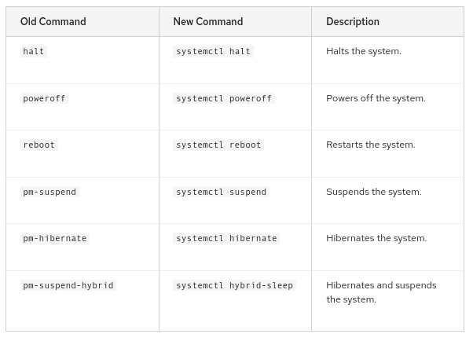

# 3.a Boot, reboot, and shut down a system normally

[RHEL 8 > Configuring basic system settings > Chapter 3. Managing services with systemd > 3.4. Shutting down, suspending, and hibernating the system](https://access.redhat.com/documentation/en-us/red_hat_enterprise_linux/8/html/configuring_basic_system_settings/managing-services-with-systemd_configuring-basic-system-settings#shutting-down-suspending-hibernating-system_managing-services-with-systemd)

In Red Hat Enterprise Linux 7, the systemctl utility replaced a number of power management commands used in previous versions of Red Hat Enterprise Linux. The commands listed in Table 3.8, “Comparison of power management commands with systemctl” are still available in the system for compatibility reasons, but it is advised that you use systemctl when possible.   

**Reboot**
+ `reboot`
+ `systemctl reboot`
+ `shutdown –r {now|+m}`
+ `telinit 6`

**Halt**  
+ `halt`
+ `systemctl halt`
+ `shutdown –H now`

**Shutdown**  
+ `poweroff`
+ `systemctl poweroff`
+ `shutdown -P now`
+ `telinit 0`

**Suspend**
+ `systemctl suspend`

**Hybernate**
+ `systemctl hybernate`

**Hibernates and suspends the system**
+ `systemctl hybrid-sleep`

**📝 NOTE:** *Only one command should be needed for the exam*

---
[⬅️ Back](3-Operate-running-systems.md)
