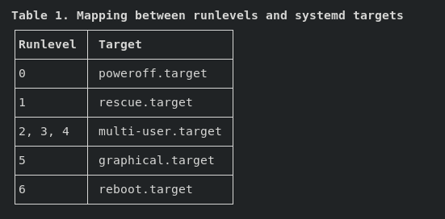

# 3.b Boot systems into different targets manually

## Runlevels and Systemd Targets RHEL 8

**📝 NOTE:** *The comparison of SysV runlevels is mainly for reference.*

### Older SysV runlevels

"Runlevels" are an obsolete way to start and stop groups of services used in SysV init. Systemd provides a compatibility layer that maps runlevels to targets, and associated binaries like runlevel.

`rc0.d/ rc1.d/ rc2.d/ rc3.d/ rc4.d/ rc5.d/ rc6.d/ rc.d/`

Commands related to SysV runlevel
+ `telinit` - Change SysV runlevel
+ `runlevel` - Print previous and current SysV runlevel

## Systemd Targets

[RHEL 8 > Configuring basic system settings > Chapter 3. Managing services with systemd > 3.3. Working with systemd targets](https://access.redhat.com/documentation/en-us/red_hat_enterprise_linux/8/html/configuring_basic_system_settings/managing-services-with-systemd_configuring-basic-system-settings#working-with-systemd-targets_managing-services-with-systemd)

List systemd targets

    # systemctl list-units --type=target
    UNIT                   LOAD   ACTIVE SUB    DESCRIPTION                 
    basic.target           loaded active active Basic System                
    cryptsetup.target      loaded active active Local Encrypted Volumes     
    getty.target           loaded active active Login Prompts               
    graphical.target       loaded active active Graphical Interface         
    local-fs-pre.target    loaded active active Local File Systems (Pre)    
    local-fs.target        loaded active active Local File Systems          
    multi-user.target      loaded active active Multi-User System           
    network-online.target  loaded active active Network is Online           
    network-pre.target     loaded active active Network (Pre)               
    network.target         loaded active active Network                     
    nfs-client.target      loaded active active NFS client services         
    nss-user-lookup.target loaded active active User and Group Name Lookups
    paths.target           loaded active active Paths                       
    remote-fs-pre.target   loaded active active Remote File Systems (Pre)   
    remote-fs.target       loaded active active Remote File Systems         
    rpc_pipefs.target      loaded active active rpc_pipefs.target           
    rpcbind.target         loaded active active RPC Port Mapper             
    slices.target          loaded active active Slices                      
    sockets.target         loaded active active Sockets                     
    sound.target           loaded active active Sound Card                  
    sshd-keygen.target     loaded active active sshd-keygen.target          
    swap.target            loaded active active Swap                        
    sysinit.target         loaded active active System Initialization       
    timers.target          loaded active active Timers  

Get current systemd target

    # systemctl get-default
    graphical.target

Set systemd target for next boot

    # systemctl set-default [target]

Change systemd target without reboot

    # systemctl isolate [target]

Change into rescue/emergency mode

    # systemctl isolate [rescue|emergency]

**📝 NOTE:** *You can also use `systemd.unit=rescue.target` (or emergency) in the boot parameters*

---
[⬅️ Back](3-Operate-running-systems.md)
