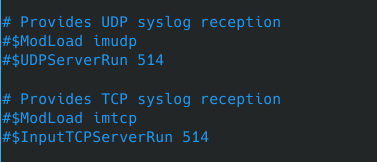

# 3.g Locate and interpret system log files and journals

**What to know for the exam:**
+ Locations of the logs - /var/log
+ systemd-analyze
+ Journalctl
+ Rsyslog remote

## Rsyslog

Most logs are written to `/var/log`.

Services that write to this folder are partially controlled by the rsyslog service.

### Configuration File

Configuration is saved in `/etc/rsyslog.conf`.

Rsyslog can record logs from another servers, or send logs to other servers.

_RHEL7_

_RHEL8_

Rsyslog can also be configured to read config (drop-in) files added by other services.

_RHEL7_

_RHEL8_

### Logging Levels

+ None – Do not log
+ 0 - Emergency/Panic
+ 1 - alerts
+ 2 - Critical
+ 3 - Error
+ 4 - Warnings
+ 5 - Notice
+ 6 - Info
+ 7 - Debug

**📌 EXAM TIP**

If you can't remember the logging levels, you can check `man rsyslog.conf `

    The  priority  is one of the following keywords, in ascending order: debug, info, notice, warn‐
    ing, warn (same as warning), err, error (same as err),  crit,  alert,  emerg,  panic  (same  as
    emerg).  The  keywords error, warn and panic are deprecated and should not be used anymore. The
    priority defines the severity of the message.

Or `man syslog` (`syslog`, not `rsyslog`) for details.

    Kernel constant   Level value   Meaning
    KERN_EMERG             0        System is unusable
    KERN_ALERT             1        Action must be taken immediately
    KERN_CRIT              2        Critical conditions
    KERN_ERR               3        Error conditions
    KERN_WARNING           4        Warning conditions
    KERN_NOTICE            5        Normal but significant condition
    KERN_INFO              6        Informational
    KERN_DEBUG             7        Debug-level messages

## Log Rotation

Configuration file is `/etc/logrotate.conf`.

Logrotate can also read config files from other services/packages in `/etc/logrotate.d`:

    # RPM packages drop log rotation information into this directory
    include /etc/logrotate.d

## Systemd and Journalctl

Systemd keeps logs stored in a binary format.  

Find error messages in all log files

    $ journalctl -p {err|[0-7]}

Find errors since yesterday

    $ journalctl -p err --since yesterday

Find all messages associated with UID 1000

    $ journalctl _UID=1000

Logs for specific service/binary

    # journalctl -u [unit.service]

    # journalctl [/path/to/binary]

## systemd-analyze

`systemd-analyze` may be used to determine system boot-up performance statistics and retrieve other state and tracing information from the system and service manager, and to verify the correctness of unit files. It is also used to access special functions useful for advanced system manager debugging.

    # systemd-analyze
    Startup finished in 984ms (kernel) + 7.382s (initrd) + 1min 29.786s (userspace) = 1min 38.153s
    graphical.target reached after 1min 29.703s in userspace

This command prints a list of all running units, ordered by the time they took to initialize.

    # systemd-analyze blame | head
             50.216s vboxadd.service
             42.899s plymouth-quit-wait.service
             17.397s vdo.service
             17.318s udisks2.service
             15.495s polkit.service
             15.348s ModemManager.service
             13.668s sssd.service
              9.738s smartd.service
              9.700s systemd-machined.service
              9.591s NetworkManager-wait-online.service

---
[⬅️ Back](3-Operate-running-systems.md)
