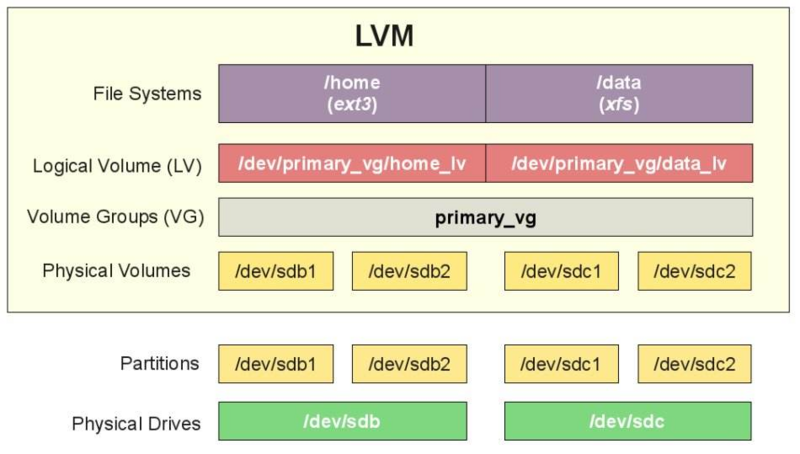

# 4.b Create and remove physical volumes

## Logical Volume Manager

Logical Volume Manager (LVM) is a device mapper target that provides logical volume management for the Linux kernel. LVM allows a pool of space to manage storage.  

+ **PV** - Physical Volumes are directly related to hard drives or partitions
+ **VG** - A Volume Group can have multiple physical Volumes
+ **LV** - A Logical Volume sits inside a Volume Group and it's what is assigned to a file system (/root, /home, etc...)

When a physical disk is setup for LVM, metadata is written at the beginning of the disk for normal usage, and at the end of the disk for backup usage.  

## Steps of Creating a Physical Volume

First create initialize the disks to be used by LVM with pvcreate (Initialize physical volume(s) for use by LVM)

    # pvcreate /dev/device /dev/device2 /dev/device3

Then we create a volume group with vgcreate (Create a volume group)

    # vgcreate [vg name] /dev/device /dev/device2 /dev/device3

_Optionally use the '-s' switch to set the Physical Extent size (for LVM2, the only effect this flag has is that when using too many physical volumes, the LVM tools will perform better)_

And finally create the Logical Volume (4GB)

    # lvcreate -L 4g [vg name] -n [lv name]

Flags:
+ `-n`  - set the Logical Volume name
+ `-l` - use extents rather than a specified size

Create the file system

    # mkfs.xfs /dev/[vgname]/[lvname]

## Creating and Deleting Physical Volumes

**Commands:**
+ lvm (8)                  - LVM2 tools
+ pvcreate (8)         - Initialize physical volume(s) for use by LVM
+ pvdisplay (8)        - Display various attributes of physical volume(s)
+ pvremove (8)         - Remove LVM label(s) from physical volume(s)
+ pvs (8)                  - Display information about physical volumes

### Creating Physical Volumes

Physical volumes can be created using full disks or partitions.

    # pvcreate /dev/part1 /dev/part2

Or

    # pvcreate /dev/sdb /dev/sdc

### Deleting Physical Volumes

`pvremove` wipes the label on a device so that LVM will no longer recognize it as a PV. A PV cannot be removed from a VG while it is used by an active LV.

Removing a PV

    # pvremove /dev/sdb /dev/sdc
    Labels on physical volume "/dev/sdb" successfully wiped.
    Labels on physical volume "/dev/sdc" successfully wiped.

Trying to remove a PV that has a VG and LV

    # pvremove /dev/sdb /dev/sdc
      PV /dev/sdb is used by VG testvg so please use vgreduce first.
      (If you are certain you need pvremove, then confirm by using --force twice.)
      /dev/sdb: physical volume label not removed.
      PV /dev/sdc is used by VG testvg so please use vgreduce first.
      (If you are certain you need pvremove, then confirm by using --force twice.)
      /dev/sdc: physical volume label not removed.

You can try to force remove with `-ff`

    # pvremove -ff /dev/sdb /dev/sdc
      WARNING: PV /dev/sdb is used by VG testvg.
    Really WIPE LABELS from physical volume "/dev/sdb" of volume group "testvg" [y/n]? y
      WARNING: Wiping physical volume label from /dev/sdb of volume group "testvg".
      WARNING: PV /dev/sdc is used by VG testvg.
    Really WIPE LABELS from physical volume "/dev/sdc" of volume group "testvg" [y/n]? y
      WARNING: Wiping physical volume label from /dev/sdc of volume group "testvg".

---
[⬅️ Back](4-Configure-local-storage.md)
